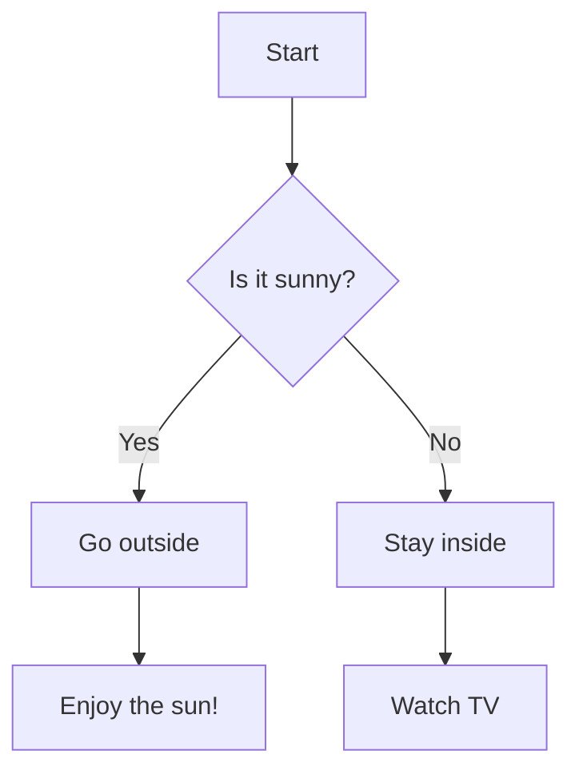

To display a diagram in Markdown using Mermaid, you need to use the Mermaid syntax inside a code block. Here’s how to do it:

1. Surround your Mermaid diagram code with triple backticks (` ``` `).
2. After the opening triple backticks, specify `mermaid` to indicate that the block contains Mermaid syntax.
3. Write your Mermaid diagram code.

Here's an example of a simple flowchart using Mermaid:

````markdown

````

This will render the diagram as a flowchart when viewed in Markdown-supported environments that recognize Mermaid diagrams (such as GitHub, GitLab, or certain Markdown editors with Mermaid integration).

Make sure that the platform or editor you're using supports Mermaid, as not all Markdown parsers do so natively.