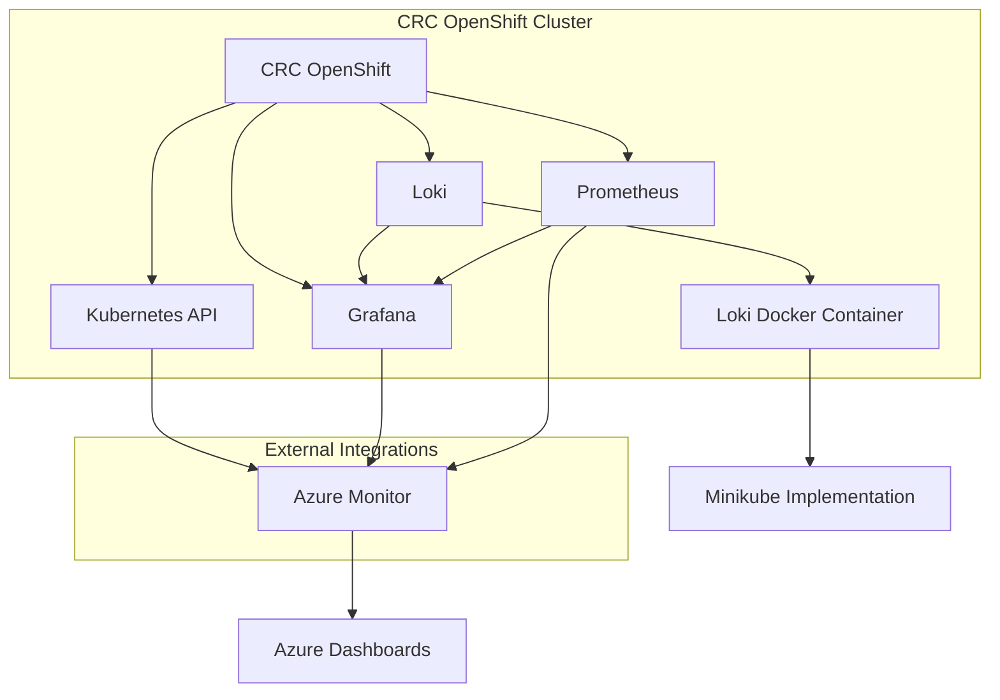

Here is a mermaid diagram illustrating the relationships between CRC OpenShift, Loki, and other related components:

This diagram shows:
- CRC OpenShift running Loki and connected to Prometheus and Grafana.
- Grafana pulling data from Loki and Prometheus for visualization.
- Loki running in a Docker container inside CRC OpenShift.
- External integration with Azure Monitor to report status to Azure Dashboards.
- A potential conversion of the Loki Docker setup to a Minikube implementation.